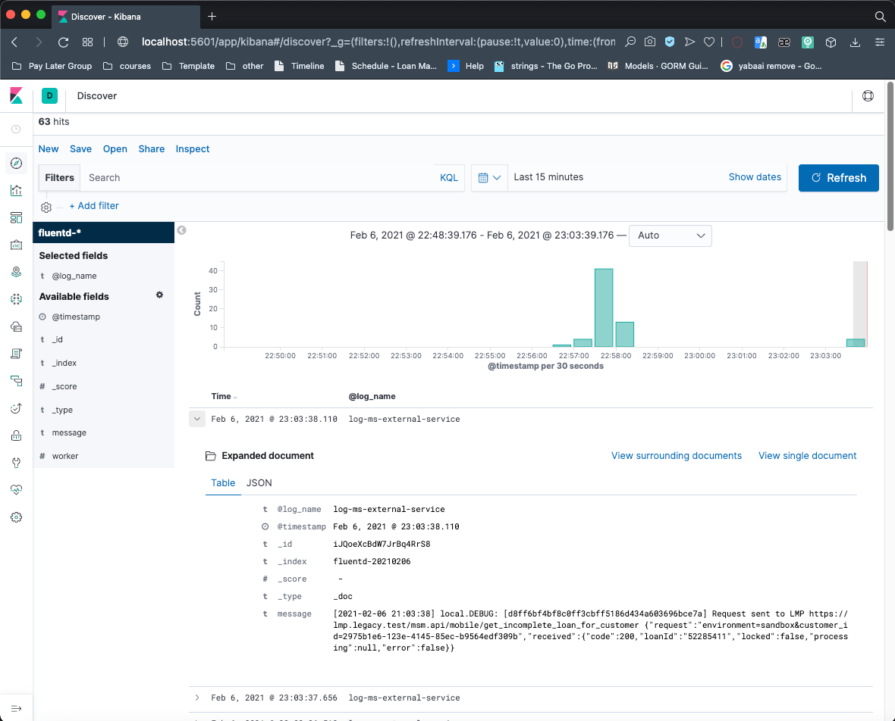

#Roadmap:

## 1. Run docker containers
```bach
docker-compose up
```

## 2. Confirm Logs from Kibana
Browse to http://localhost:5601/ and set up the index name pattern for Kibana. Specify fluentd-* to Index name or pattern and click Create.

Then, go to Discover tab to check the logs. As you can see, logs are properly collected into the Elasticsearch + Kibana, via Fluentd.

